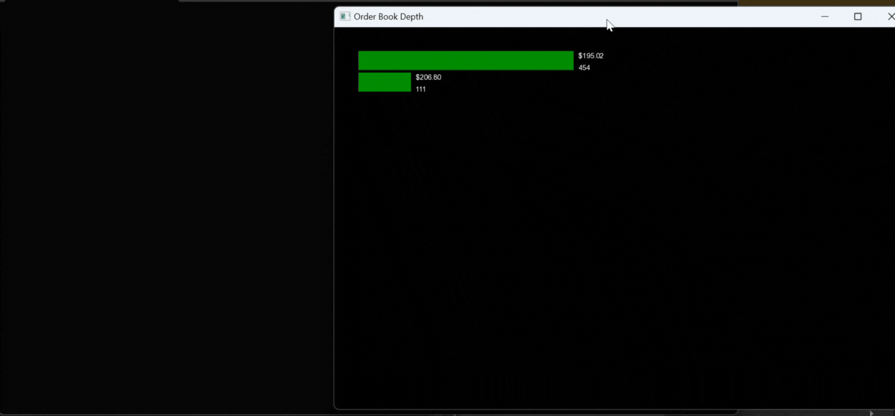

# C++ Orderbook

This project is an implementation of an **Orderbook** system in C++, featuring multithreaded execution, basic order matching, and a simple GUI for real-time visualization. The system efficiently matches buy and sell orders while allowing live updates of the orderbook state.



# Features

## Multithreading
- One thread generates random orders (buy and sell) with support for multiple order types.
- Another thread handles order matching based on the type and priority of the orders.
- The main thread is responsible for rendering the GUI.

## Order Types
- **GoodTillCancel (GTC):** Orders remain active until explicitly canceled.
- **FillAndKill (FAK):** Orders execute immediately for the available quantity; unfulfilled quantities are canceled.
- **FillOrKill (FOK):** Orders execute immediately and completely; if full execution is not possible, the order is canceled.
- **GoodForDay (GFD):** Orders remain valid until the end of the trading day.
- **Market Orders:** Execute immediately at the best available price.

## Order Matching
- Implements price-time priority matching for limit orders.
- Handles partial order fulfillment for applicable order types.
- Includes specific behavior for each order type:
  - Time-based expiration for `FOK` and `GFD` orders.
  - Immediate cancellation for unfulfilled `FAK` orders.
- Real-time removal and insertion of orders into the orderbook.

## Simple GUI
- A graphical interface built with SFML displays:
  - Orderbook depth, updated in real time.
  - Matched orders, categorized by type.
  - Status of expired or canceled orders.

## Data Structures
- Uses priority queues to efficiently manage buy and sell orders while maintaining price-time priority.
- Enhanced to handle and prioritize orders based on their type and associated rules.
  
## Table of Contents

- [Installation](#installation)
- [Usage](#usage)
- [Project Structure](#project-structure)
- [Order Matching Logic](#order-matching-logic)
- [Contributing](#contributing)
- [License](#license)

## Installation

### Prerequisites

Ensure you have the following installed on your system:

- **C++17 or later**: Required for modern C++ features.
- **CMake**: For building the project.
- **SFML**: Used for the GUI. Install it as follows:

    **Linux:**
    ```bash
    sudo apt-get install libsfml-dev
    ```

    **macOS (with Homebrew):**
    ```bash
    brew install sfml
    ```

    **Windows**: Download and install from the official [SFML website](https://www.sfml-dev.org/).

### Build Instructions

1. Clone the repository:
    ```bash
    git clone https://github.com/yourusername/orderbook.git
    cd orderbook
    ```

2. Create a build directory and navigate into it:
    ```bash
    mkdir build
    cd build
    ```

3. Run CMake to configure the project:
    ```bash
    cmake ..
    ```

4. Build the project:
    ```bash
    make
    ```

5. Run the executable:
    ```bash
    ./orderbook
    ```

## Usage

Once the application is built and running, the GUI will display live updates of the orderbook with the following features.

- **Random Buy/Sell Orders**: The system automatically generates random buy and sell orders in a separate thread.
- **View Orderbook Depth**: The GUI visualizes the current depth of the orderbook (bid/ask volumes).
- **Order Matching**: A separate thread continuously matches buy and sell orders according to price and time priority.

### Example Workflow:

1. **Launching the GUI**: Upon running the program, a window with a visual representation of the orderbook is displayed.
2. **Order Generation**: Orders are generated every second in a separate thread and added to the orderbook.
3. **Order Matching**: Another thread continuously checks for matching orders and executes them when conditions are met.
4. **Visualization**: The GUI updates in real-time to reflect new orders and matched trades.

## Project Structure

The project consists of several key components:

- **Order**: Represents a buy or sell order with properties like price, quantity, and order type.
- **Orderbook**: Manages the list of current buy and sell orders using priority queues. Provides methods to add, remove, and retrieve the best orders.
- **OrderMatchingEngine**: Handles the core matching logic, executing orders when prices align and managing partial order fulfillment.
- **OrderbookVisualizer**: Uses SFML to render a graphical representation of the orderbook depth (volume of orders at different price levels).

## Order Matching Logic

The order matching engine supports various order types and operates as follows:

### 1. **Order Types**
- **Market Orders**: Executes immediately against the best available prices.
- **Fill-Or-Kill (FOK)**: Executes immediately and completely; otherwise, the order is canceled.
- **Fill-And-Kill (FAK)**: Partially fills the order with the best available matches and cancels the remaining quantity.

### 2. **Matching Logic**
- **Price-Time Priority**:
  - Orders are matched based on price. For orders with the same price, the time of submission determines priority (First-In-First-Out).
- **Partial Matches**:
  - If a buy order's quantity exceeds the best matching sell order's quantity (or vice versa), the remaining quantity is reprocessed (for FAK) or canceled (for FOK).
- **Execution**:
  - Fully matched orders are removed from the order book.
  - Partially matched orders (depending on the type) may either be retained with updated quantities or canceled.

### 3. **Fill-Or-Kill (FOK)**
- FOK orders must be completely satisfied upon submission. If not, they are immediately canceled:
  - If a matching sell order (for buy FOK) or buy order (for sell FOK) exists with sufficient quantity at the required price or better, the order executes.
  - If no sufficient match is available, the order is canceled entirely.

### 4. **Fill-And-Kill (FAK)**
- FAK orders execute as much as possible upon submission, with any unmatched portion canceled:
  - Matches are made against the best available orders in the book.
  - If a partial match occurs, the remaining quantity is canceled.
  - Fully matched orders are executed and removed.

### 5. **Market Orders**
- Market orders match the best available orders on the opposite side of the order book:
  - Execution continues until the order's quantity is completely fulfilled or no further matching orders exist.
  - Remaining unmatched portions are left open if the market order type allows (e.g., GTC or GFD).

### 6. **Example Workflow**
- **Buy Order Matching**:
  - Check the best available sell order.
  - Compare the buy order price against the sell order price:
    - If the buy price is greater than or equal to the sell price, execute the match.
    - If unmatched quantities remain, reprocess or cancel based on the order type.
- **Sell Order Matching**:
  - Similar logic is applied in reverse for sell orders.

### 7. **Edge Cases**
- If no matching orders are available:
  - FOK orders are canceled.
  - FAK orders are partially filled, and the rest is canceled.

Refer to the implementation in `OrderMatchingEngine.cpp` for detailed logic.
